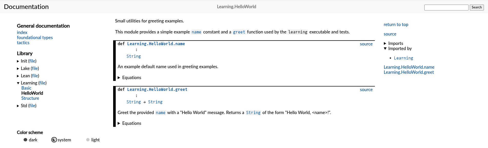

# Learning Lean

[Lean][lean-homepage] is an open-source programming language and proof assistant
that enables correct, maintainable, and formally verified code.

## Installation

This project requires Lean 4. You can install it using
[Elan](https://github.com/leanprover/elan).

### Linux

```bash
curl https://raw.githubusercontent.com/leanprover/elan/master/toolchain.sh | sh
```

Alternatively, follow the instructions on the
[Lean installation page][lean-installation].

## First Steps

Create a new project:

```bash
lake new learning
```

Then you should be able to build and run the project:

```bash
make build
# or: lake build

lake exe learning <name>
# e.g. lake exe learning "Frank Jung"
```

## Basic Concepts

The [Basic.lean](Learning/Basic.lean) file contains examples of basic concepts
in Lean.

## Development

A `Makefile` is provided to simplify development and testing targets.

### Makefile Targets

```bash
# Build the project
make build

# Run the unit test suite
make test

# Run the linter
make lint

# Generate documentation
make doc
```

### Toolchain Versioning

This project is pinned to Lean `v4.31.0` using the
[lean-toolchain][toolchain-link] file. Elan automatically detects this
file and uses the correct version for all builds and commands.

To explicitly set your default Lean version to `v4.31.0` using Elan, run:

```bash
elan default leanprover/lean4:v4.31.0
```

To check your current active Lean version, run:

```bash
lean --version
```

```bash
$ lean --version
Lean (version 4.31.0, x86_64-unknown-linux-gnu, commit 68218e876d2a38b1985b8590fff244a83c321783, Release)
```

#### Example: lake version

```bash
$ lake --version
Lean (version 4.31.0, x86_64-unknown-linux-gnu, commit 68218e876d2a38b1985b8590fff244a83c321783, Release)
```

### Managing Dependencies

[lake-manifest.json][manifest-link] is the **lock file** for your
dependency tree. Once it is generated, `lake build` uses the exact
commits recorded there without re-fetching anything.

> **Warning**: Do **not** run `lake update` for routine builds.
> It re-resolves all floating-ref transitive dependencies
> (`main`, `master` branches) to their latest commits. Those
> commits may require a newer Lean toolchain, and — when
> `fixedToolchain: false` — Lake will silently overwrite
> `lean-toolchain` with the newer version.
>
> Only run `lake update` when you intentionally want to add
> or upgrade a direct dependency. After doing so, always verify
> the toolchain has not changed:
>
> ```bash
> cat lean-toolchain
> # must still print: leanprover/lean4:v4.31.0
> ```
>
> If it changed, restore it and commit both files:
>
> ```bash
> echo "leanprover/lean4:v4.31.0" > lean-toolchain
> git add lean-toolchain lake-manifest.json
> git commit -m "chore: lock toolchain to v4.31.0"
> ```

To add a new dependency while remaining on the pinned Lean prover
version `v4.31.0`:

1. **Add the requirement to [lakefile.toml][lakefile-link]**:
   Append a new `[[require]]` block. Pin the version to match the
   toolchain (e.g. `version = "git#v4.31.0"` or
   `rev = "v4.31.0"`):

   ```toml
   [[require]]
   name = "SomeLib"
   scope = "leanprover-community"
   version = "git#v4.31.0"
   ```

2. **Resolve the new dependency**:

   ```bash
   lake update
   ```

   Then verify `lean-toolchain` is still `v4.31.0` (see warning
   above) and restore it if necessary.

3. **Rebuild the project**:

   ```bash
   make build
   # or: lake build
   ```

### Project Structure

- `Learning.lean`: The entrypoint for the `learning` executable.
- `Learning/`: Directory containing the library modules:
  - `All.lean`: Convenience re-export of all library modules.
  - `Basic.lean`: Basic concepts — conditionals, arithmetic, types.
  - `HelloWorld.lean`: Greeting utilities used by the executable.
  - `Irrational.lean`: Proof of the irrationality of the square root of 2.
  - `Structure.lean`: A 2D `Point` structure and helpers.
- `Test.lean`: The test runner entrypoint that executes the test suite.
- `Test/`: Directory containing tests corresponding to each lesson.
  - `Util.lean`: Test utilities including assertion helpers.
- `lakefile.toml`: Package build configuration for Lake.

## CI/CD

### CI/CD Workflow

This project uses GitHub Actions for continuous integration and deployment. The
workflow is defined in the
[.github/workflows/lean_action_ci.yml](.github/workflows/lean_action_ci.yml)
file. It builds, tests, and lints the project on every push.
Pushes to the `main` branch also automatically generate and deploy the project
documentation to GitHub Pages.

### Linting

This project uses `lake lint` with the
[Batteries](https://github.com/leanprover-community/batteries) linter.
To run the linter locally (assuming dependencies are already resolved):

```bash
make lint
# or using lake directly:
lake build
lake lint
```

If the linter reports missing documentation or unused-argument warnings, edit
the indicated files to satisfy the linters (there is no general autofix).

Configuration: this project uses the `batteries` linter driver. The `batteries`
runner reads `scripts/nolints.json` (if present) to store and retrieve
suppressed lint entries. To update the `nolints` file after inspecting linter
output, run:

```bash
lake lint --update
```

To add project-specific suppressions, create or edit `scripts/nolints.json`.

### Testing

To run the tests locally, run:

```bash
make test
# or using lake directly:
lake test
```

This will rebuild the project and execute the tests defined in the `Test`
directory.

### Documentation

The project documentation is automatically published to GitHub Pages and can be
viewed at:
[https://frankhjung.github.io/lean-learning/](https://frankhjung.github.io/lean-learning/)

To generate the project documentation locally, run:

```bash
make doc
# or using lake directly:
cd docbuild
lake update doc-gen4   # safe: updates only doc-gen4
lake build Learning:docs
```

Once generated, you can serve the documentation locally on
[http://localhost:8000](http://localhost:8000) with:

```bash
python3 -m http.server --directory docbuild/.lake/build/doc 8000
```

Or open a browser to `./docbuild/.lake/build/doc/index.html`:

```bash
# Default Browser
exo-open --launch www docbuild/.lake/build/doc/index.html

# Google Chrome
google-chrome docbuild/.lake/build/doc/index.html
```

#### Example



## GitHub Actions

The following GitHub Actions are used in this project:

- [actions/checkout](https://github.com/actions/checkout)
- [leanprover/lean-action](https://github.com/leanprover/lean-action)
- [actions/upload-pages-artifact](https://github.com/actions/upload-pages-artifact)
- [actions/deploy-pages](https://github.com/actions/deploy-pages)

## Resources

- [API Documentation][lean-api-docs] - The API documentation for Lean.
- [FAQ][lean-faq] - A frequently asked questions page about Lean.
- [Functional Programming in Lean][functional-programming-in-lean] - A book on
  functional programming in Lean.
- [Lean GitHub][lean-github] - The GitHub repository for Lean.
- [Lean Homepage][lean-homepage] - The official homepage of Lean.
- [Lean Language Guide][lean-language-guide] - A guide to the Lean programming
  language.
- [Notebook][lean-notebook] - A notebook interface for Lean.
- [Package Reservoir][lean-reservoir] - The package registry for Lean.
- [Verso][lean-verso] - Writing documentation with Lean.

## License

This project is licensed under the
[GNU General Public License Version 3](LICENSE).

[functional-programming-in-lean]: https://lean-lang.org/functional_programming_in_lean/
[lakefile-link]: lakefile.toml
[lean-api-docs]: https://lean-lang.org/doc/api/
[lean-faq]: https://lean-lang.org/faq/
[lean-github]: https://github.com/leanprover/lean4
[lean-homepage]: https://leanprover.github.io/
[lean-installation]: https://lean-lang.org/install/
[lean-language-guide]: https://lean4.dev/language
[lean-notebook]: https://notebooklm.google.com/notebook/c5971c43-5793-44b4-8fa9-65a968dfe8c5
[lean-reservoir]: https://reservoir.lean-lang.org/
[lean-verso]: https://verso.lean-lang.org/
[manifest-link]: lake-manifest.json
[toolchain-link]: lean-toolchain
